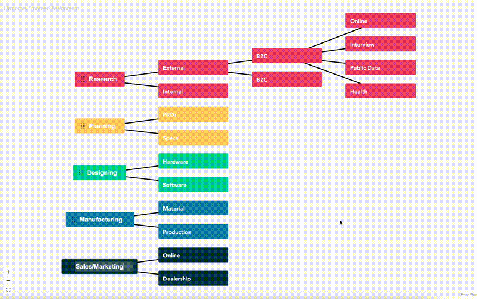

# Lizmotors Frontend Assignment - Timeline Mindmap Dashboard

The Lizmotors Frontend Assignment is a part of the 2024 FrontEnd-Coding Challenge which aims to represent the car manufacturing process through an interactive timeline-mindmap dashboard. This dashboard is designed to provide the management team of a Car Manufacturer with a visual breakdown of the project phases: Market Research, Planning, Design, Manufacturing, and Sales.

## Demo



## Features

- Interactive timeline-mindmap showcasing the car manufacturing process phases.
- Hover-over phase details displaying additional information.
- Responsive and user-friendly design for various devices and screen sizes.

## Technical Requirements

- HTML5, CSS3, and JavaScript for front-end development.
- Responsive design for compatibility across different devices.
- Cross-browser compatibility.

## Technologies Used

- React 18 with TypeScript for scalable, robust & maintainable application development.
- [Vite](https://vitejs.dev/guide/) for an optimized and fast build tooling.
- [React Flow](https://reactflow.dev/) for an intuitive mindmap visualization.
- [Zustand](https://docs.pmnd.rs/zustand/getting-started/introduction) Small, simple and fast custom state management.
- [Saas](https://sass-lang.com/) For powerful styling.
- [Yarn](https://yarnpkg.com/) Stable and easy to use package manager.

## Project Setup

### Prerequisites

- Node.js installed on your system.

### Installation

1. Clone the repository to your local environment.
2. Install the necessary dependencies by running:

```bash
yarn install
```

### Development Server

Start the development server with:

```bash
yarn dev
```

Access the application at http://localhost:3000.

### Production Build

Compile and prepare the application for production using:

```bash
yarn build
```
